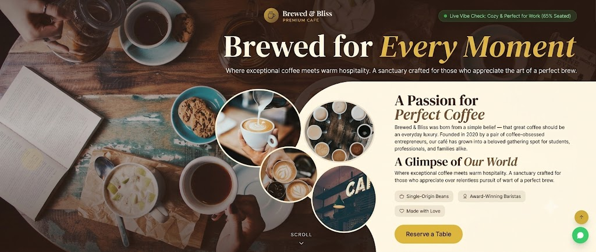

# ☕ Brewed & Bliss — Premium Café Management Web App

Brewed & Bliss is a modern, responsive full-stack web application designed to deliver an elegant, digital representation of a premium artisan café experience. Designed to bridge the gap between digital discovery and real-time storefront aesthetics, the application caters to remote professionals, coffee aficionados, and casual diners alike. It features an immersive, sunlit design language, live seating data tracking, dynamic menu exploration, and automated seat reservation capabilities built to scale.


---

###  Landing Page Preview



---

##  Features

### 1. Customer Experience
*   **Live Vibe Check:** Real-time visibility into the cafe's seating availability and environment to help remote workers and guests optimize their visits.
*   **Aesthetic Digital Menu:** A fully filtered, categorized menu displaying house specials, bestsellers, dietary indicators (Veg/Non-Veg), preparation times, and interactive guest ratings.
*   **Sip & Sound Hub:** An embedded, interactive ambient audio streaming widget featuring low-fi jazz mixes and cafe rain soundscapes to emulate the storefront vibe digitally.
*   **Interactive Bean-to-Cup Journey:** An animated, step-by-step visual roadmap showcasing the cafe's ethical sourcing, micro-roasting, and artisanal brewing processes.
*   **Seamless Table Reservations:** A clean workflow allowing users to easily secure and manage bookings ahead of time.

### 2. Admin & Content Management
*   **Role-Based Access Control:** Secure routes protected by role checks tied straight to Supabase metadata (`user.app_metadata.role`), restricting operational management exclusively to authenticated managers.
*   **Dynamic Fresh Board:** A digital slate component managed by the team to broadcast daily pairing suggestions and barista notes.
*   **Content Synchronization:** Real-time updates for menu additions, changing bestseller statuses, collection galleries, and verified regular guest testimonials.

---

##  Tech Stack & Architecture

*   **Frontend Framework:** React 18 with TypeScript
*   **Build Tool / Bundler:** Vite
*   **Styling:** Tailwind CSS (Custom text-gradients, cinematic film-grain textures, glassmorphism, and responsive layouts)
*   **Icons:** Lucide React
*   **Backend-as-a-Service:** Supabase (PostgreSQL database, real-time listeners, and Row Level Security for user authentication)
*   **State & Utilities:** Component lifecycle hooks managing asynchronous layout state, custom intersection observer counters, and standalone HTML5 audio element refs.

---

##  Repository Structure

```text
├── src/
│   ├── components/
│   │   ├── AnimatedSection.tsx    # Scroll-triggered viewport animations
│   │   ├── SteamAnimation.tsx     # Custom CSS animated hot coffee steam vector
│   │   └── Skeleton.tsx           # Layout-aware content loaders for async fetches
│   ├── lib/
│   │   └── supabase.ts            # Supabase client Initialization & TypeScript schemas
│   ├── pages/
│   │   ├── HomePage.tsx           # Hero, live analytics, roadmap, audio hub, & previews
│   │   ├── MenuPage.tsx           # Full interactive catalog grid
│   │   ├── AdminLogin.tsx         # Dedicated manager authentication page
│   │   └── Reservations.tsx       # Dynamic table booking interface
│   ├── App.tsx                    # Route switching & overarching role-based guards
│   └── main.tsx                   # Client mounting point
├── public/                        # Static aesthetic assets
├── tailwind.config.js             # Theme extensions & animation keyframe configurations
└── package.json                   # Project scripts and dependencies

```

<p align="center"> ✨ Maintained by <a href="https://github.com/yashhavalannache">Yash Havalannache</a> ✨ </p> 